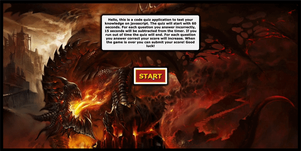

## Web APIs: Code Quiz

## About

For this week’s homework I have build a timed coding quiz with multiple-choice questions. This app will run in the browser and will feature dynamically updated HTML and CSS powered by JavaScript code that you write. It will have a clean, polished, and responsive user interface.

Simply press the start button to take a timed quiz on JavaScript fundamentals. Once you press start the first question will appear and the timer will begin to countdown. After submitting an answer you will be presented the next question in the quiz. Disclaimer: If you answer a question incorrectly then time is subtracted from the clock!
After all the questions have been answered, or the timer has hit 0, then the game is over. Once the game is over then you can then save your initials and see you score.

Enjoy!

## Preview of deployed application

## Links to GitHub and deployed application

https://1bretly.github.io/Homework-Code-Quiz/
https://github.com/1bretly/Homework-Code-Quiz
